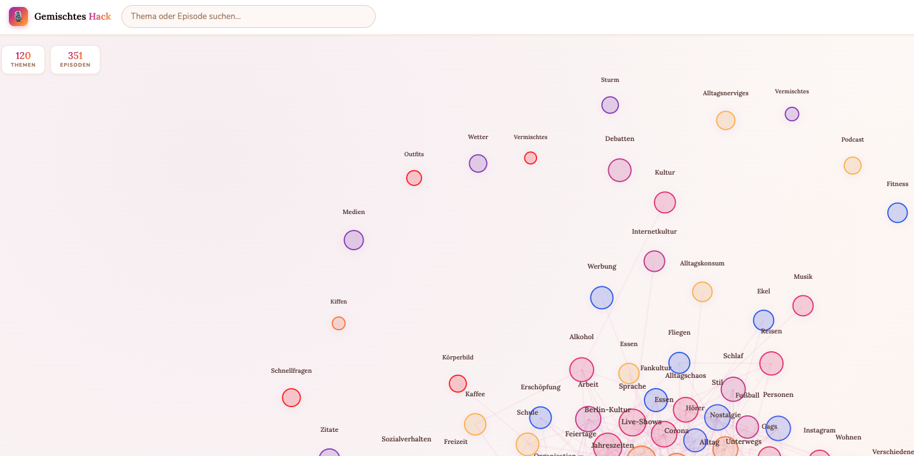
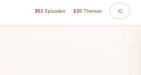
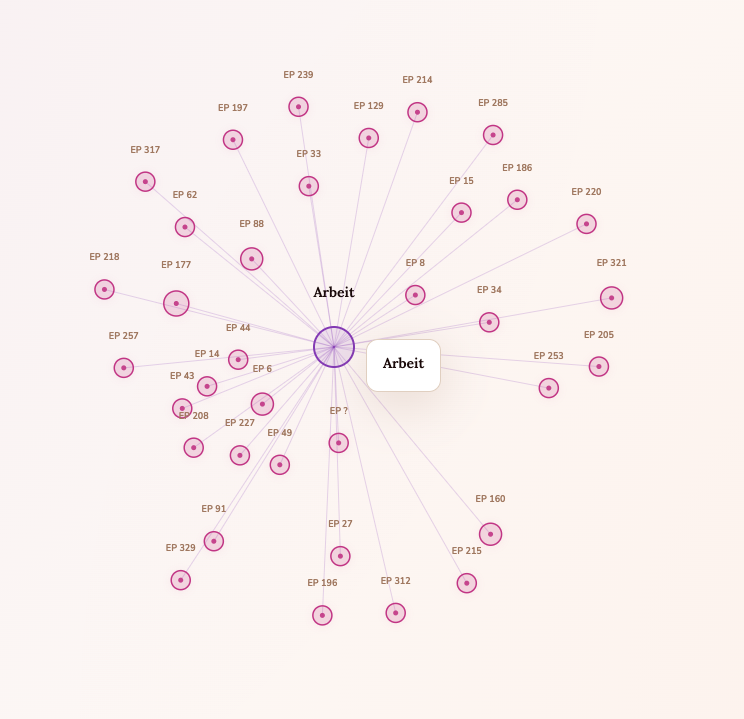
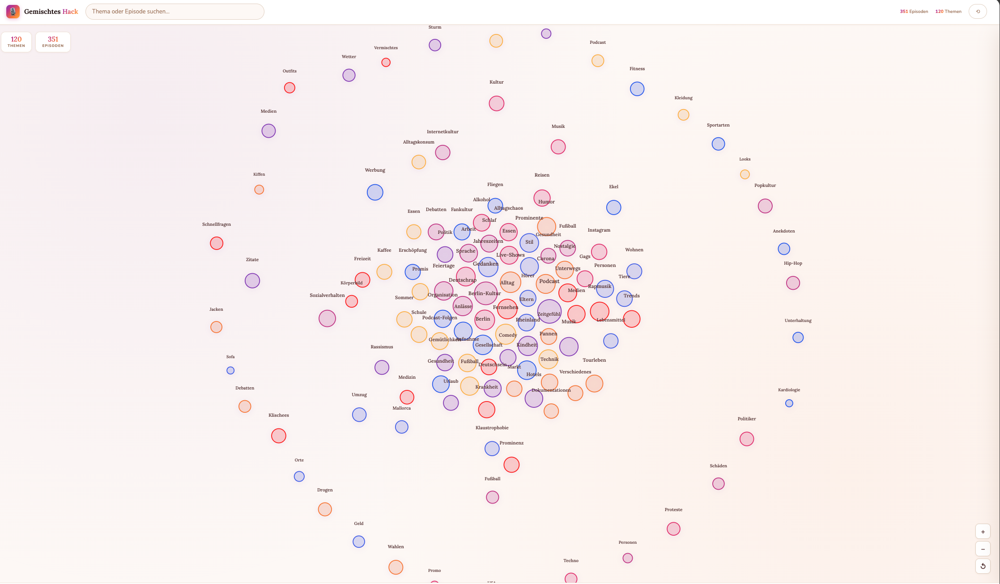

# Building a Topic Universe for Gemischtes Hack

*How we turned 351 podcast episodes into an interactive knowledge graph — from transcript to visual explorer, iterating through data, UX, and design.*

---

## The Starting Point

We had a dataset: **351 fully transcribed episodes** of *Gemischtes Hack*, the German comedy podcast by Felix Lobrecht and Tommi Schmitt. Every episode was transcribed with mlx-whisper, diarized into two speakers, and stored as structured JSON. A goldmine of conversational data — but impossible to browse at scale.

The question: **What have they talked about over 350+ episodes, and how does it all connect?**

## Step 1 — Extracting Topics with GPT

The first step was getting GPT to read every episode transcript and extract a summary plus a list of topics. We used GPT-5.4 with a German-language system prompt that instructed the model to return structured JSON:

```json
{
  "summary": "Felix erzählt von seinem Auftritt in Köln...",
  "topics": ["Stand-up Comedy", "Köln", "Publikumsinteraktion", ...]
}
```

Processing 351 episodes cost about **$5.35** — a few cents per episode. The `--dry-run` flag let us estimate the cost before committing. We also added `--resume` so the pipeline could be interrupted and restarted without re-processing finished episodes.

The result: **3,001 unique topic labels** across all episodes.

## Step 2 — The First Graph (Too Many Nodes)

The naive approach: one node per topic, edges to every episode it appears in. The immediate problem was obvious — 2,909 visible topic nodes crammed into one force-directed graph. It was an unreadable hairball. Every node fought for space, labels overlapped, and the structure told you nothing.

**Lesson:** Raw extraction output is not a UI.

## Step 3 — K-Means Clustering

To tame 3,001 topics, we embedded them using OpenAI's `text-embedding-3-large` model (3,072 dimensions) and ran **k-means clustering** to group similar topics into ~120 super-clusters.

A few deliberate engineering choices:

- **Pure numpy implementation** — no sklearn. K-means is simple enough that we wrote it from scratch: k-means++ initialization, cosine distance, iterative assignment. This kept dependencies minimal.
- **Cosine distance** — better suited for semantic embeddings than Euclidean.
- **k-means++ init** — avoids the random-centroid problem. One subtlety: negative floating-point artifacts in the distance probabilities required a `np.clip(min_dists, 0, None)` fix.
- **GPT-generated cluster names** — after clustering, we sent each cluster's top topics to GPT and asked for a concise German label. "Fußball & Sport", "Dating & Beziehungen", "Reisen & Urlaub", etc.

The result: a clean Level 1 with 120 named clusters, each containing 10–50 related sub-topics.

## Step 4 — The Episodes-First Insight

The initial Level 2 design showed sub-topics as primary nodes when you drilled into a cluster. But a quick reality check revealed the problem: **~99% of sub-topics appeared in only one episode**. Drilling into a cluster just showed a list of disconnected leaf nodes — no interesting structure.

The fix was to flip the hierarchy: **episodes become the primary nodes** at Level 2. When you click a cluster, you see every episode that touches that cluster's topics, connected to each other by **shared sub-topics**. Now the graph shows you which episodes are related *within* a theme, and the panel lists the specific overlapping topics.

A `getSimilarEpisodes()` helper function walks the active edges to find which episodes share the most connections with the selected one.

**Lesson:** The interesting unit isn't the topic — it's the episode. Topics are connective tissue, not destinations.

## Step 5 — The Design Overhaul

The initial graph used a dark "Tokyo Night" developer theme — functional, but generic. A UI designer created a reference mockup with a completely different aesthetic:

- **Warm cream background** (`#fdf8f5`) instead of dark navy
- **Instagram-gradient accents** (purple → pink → orange) for interactive elements
- **Google Fonts**: Lora (serif) for titles, Nunito (sans-serif) for UI text
- **Floating stat cards**, pill-shaped search, zoom controls, gradient badges

We kept our D3.js SVG-based graph (the mockup used Canvas for a demo) but adopted the entire visual language:

- **8-color pastel palette** for cluster nodes, cycling through the array
- **Translucent nodes** (`fill-opacity: 0.18`) with colored strokes — light and airy
- **Serif labels** for cluster names, sans-serif for episode numbers
- **Hero panel** with gradient badge, serif title, and tag chips
- **Episode format**: `EP 042` with German quotation marks (`„..."` ) for titles

The result felt like a product rather than a prototype.

## The Numbers

| Metric | Value |
|--------|-------|
| Episodes processed | 351 |
| Raw topics extracted | 3,001 |
| K-means clusters | 120 |
| Embedding dimensions | 3,072 |
| Total API cost | ~$5.50 |
| Embedding file size | ~56 MB (gitignored) |
| Frontend bundle | ~40 KB (HTML + CSS + JS) |
| Graph data (JSON) | ~2 MB |

## Architecture in One Diagram

```
transcripts/*.json
        │
        ▼
  extract_topics.py         GPT-5.4 → summary + topics per episode
        │
        ▼
  data/episode_topics.json
        │
        ▼
  build_graph.py            Embed → k-means (120 clusters) → GPT naming
        │                   → similarity edges → graph.json
        ▼
  site/graph.json
        │
        ▼
  site/index.html           D3.js 2-level force-directed graph
  site/style.css            Warm light theme
  site/graph.js             Cluster → episode drill-down
```

## What We'd Do Differently

1. **Start with episodes as the primary entity.** We wasted an iteration discovering that 1-episode sub-topics aren't useful navigation targets.
2. **Cluster count is a tuning knob.** 120 works well for 351 episodes, but the `--clusters` flag lets you experiment. Too few → huge blobs. Too many → back to hairball.
3. **Embedding caching is essential.** The `.npz` files are 56 MB but save ~$0.10 and several minutes on every re-run.

## Gallery

| Cluster Overview | Cluster Panel |
|---|---|
|  |  |

| Episode Drill-Down | Episode Panel |
|---|---|
|  |  |

---

*Built with D3.js, OpenAI GPT-5.4, text-embedding-3-large, and numpy. Total cost: ~$5.50.*
